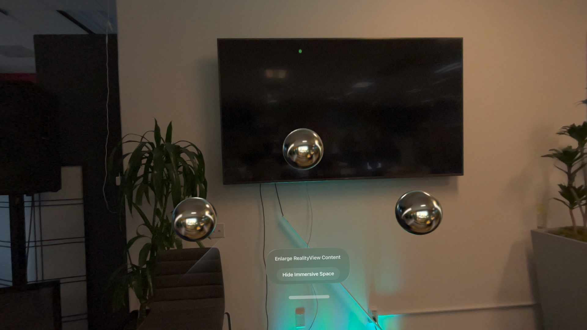

#  glTF Starter for visionOS

This is a modified version of the Xcode 26 visionOS starter code. Instead of loading *USD* assets from the RealityKitContent package, it loads *glTF* assets via Warren Moore's [GLTFKit2](https://github.com/warrenm/GLTFKit2) framework. You can use it as the basis for your glTF-based visionOS projects.



## To use glTFStarter as the starter code for your project

* [Set up the xprename utility so you can rename the project to whatever name you want.](#xprename) (If you'd rather not install this tool, you can manually replace all mentions of "glTFStarter" with the name of your new project.)

Then either

* [Include the glTF changes to the starter project in your new project's history](#keephistory) **or**
* [Treat glTFStarter like a regular Xcode starter project](#nukehistory)

## Setting up xprename<a name=xprename></a>

[xprename](https://github.com/StewartLynch/XcodeProjectRenamer) is a handy utility that lets you rename an Xcode project. Here, we'll be using it to rename the project from "glTFStarter" to whatever NewProjectName you want.

To install xprename, use [Homebrew](https://brew.sh). *Note the nonstandard package.*
```
brew install stewartlynch/tap/xprename
```

## Include the glTF changes to the starter project in your history<a name=keephistory></a>

In this approach, you keep the git history of glTFStarter's changes to the standard Apple visionOS starter project as part of your new project. Be sure to set your new project's origin to *your* repo, or you'll try (and fail) to push your changes to the glTFStarter repository.

```
git clone git@github.com:jeradesign/glTFStarter.git NewProjectName
cd NewProjectName
xprename glTFStarter NewProjectName
# Now would be a good time to change the project’s Development Team and Bundle Identifier!
git add . # add name changes
git commit -m "Rename project to NewProjectName"
git remote set-url origin git@github.com:your-account/NewProjectName.git
git push
```

## Treat glTFStarter like a regular Xcode starter project<a name=nukehistory></a>

In this approach, you nuke glTFStarter's history, and start anew with the modified project as your "Initial Commit"

```
git clone git@github.com:jeradesign/glTFStarter.git SpatialTracker
cd SpatialTracker
xprename glTFStarter SpatialTracker
rm -rf .git # nuke history
git init 
# Now would be a good time to change the project’s Development Team and Bundle Identifier!
# Also a good time to delete this README (and its Images directory) and maybe the License file.
git add .
git commit -m "Initial Commit"
```
